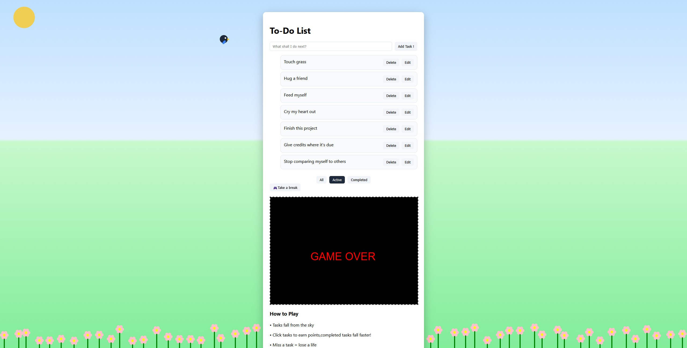

# Interactive To Do List with JavaScript

----
*This is a project where I get to use the knowlegde learned in 263 so far*   

What can you do?

Add your task 
Keep track of what was done in the completed tab 
Filter your task based on their status 
Local storage implemented (so that you don't lose your precious task if you reload) 
Take a break by playing a simple game  
Switch between Day and Night  
Watch Tweet pass by  

Controls:  
Click on a task to mark it complete 
Click again to undo the completation state 
Add your task with Enter key 
Save your edited task with Enter key 
All buttons are functional 
Use a mouse to play our little game ,it more easy !  

---

**FUNCTIONS**

Gamifying your tasks  
Instructions for controls on screen 
Modern CSS  

*Curious about my code?* 
I have linked all the sources I used to program this in brainstorm (except Sabine CART263 class ressources)
Feel free to check it out and get inspired!   

*Curious about the CSS?* 
My sources for css is linked in brainstorming as well! 

Learned: 
.forEach()
